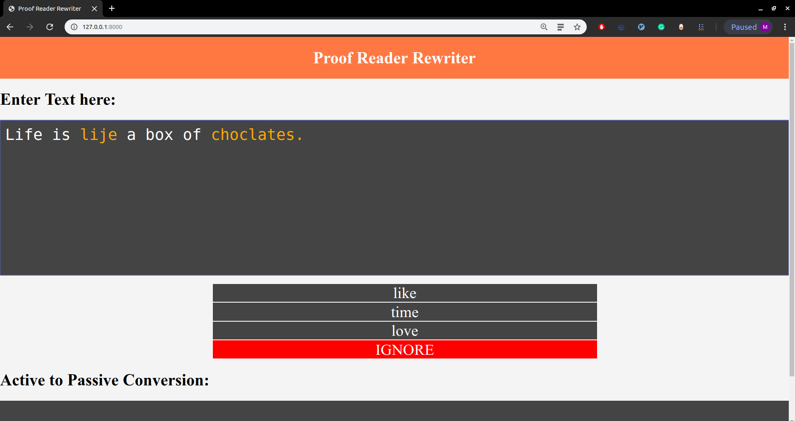
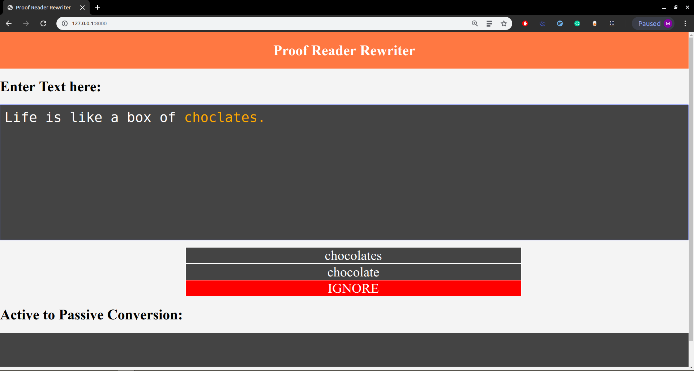
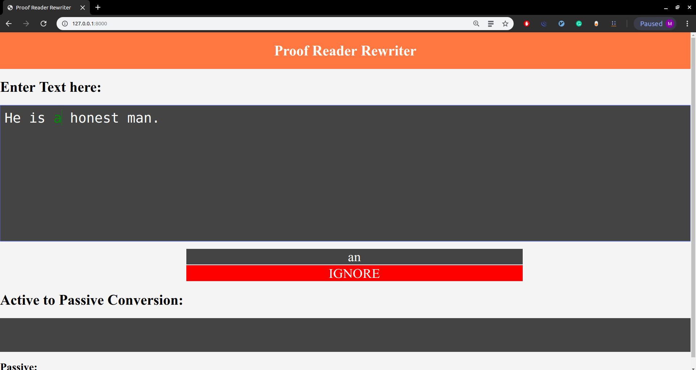
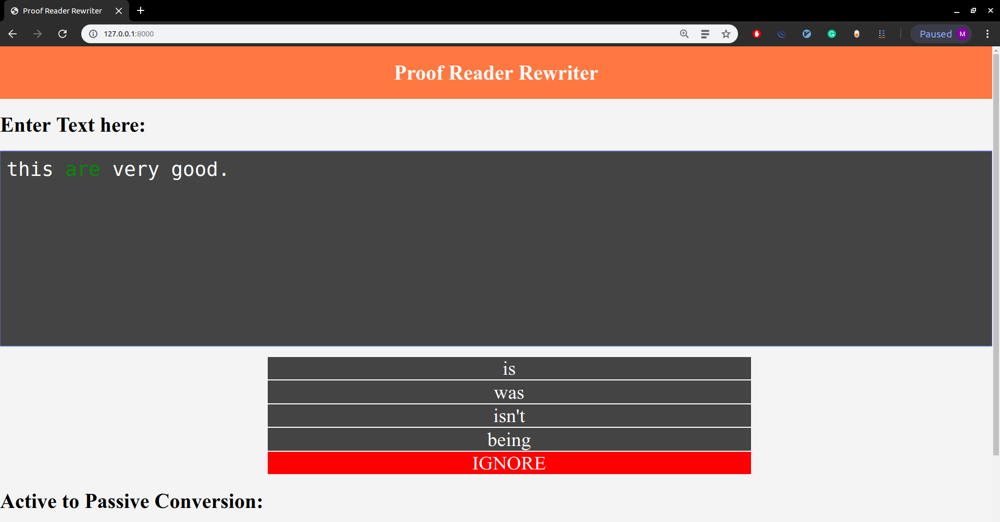
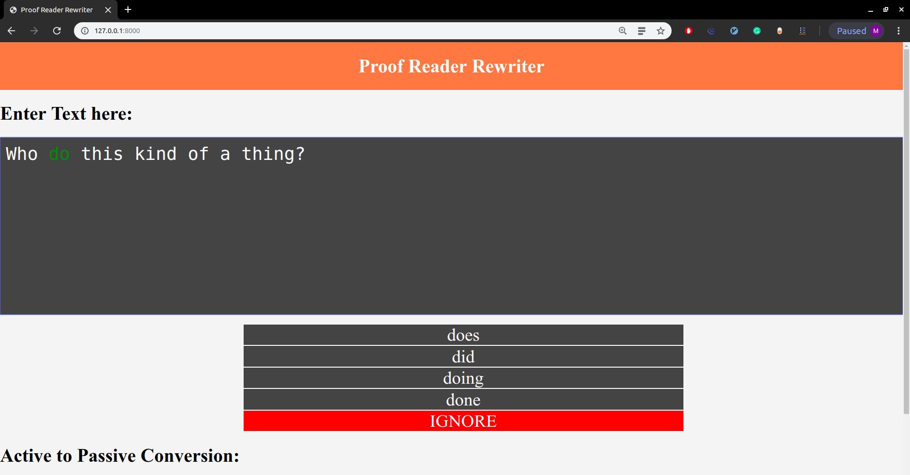
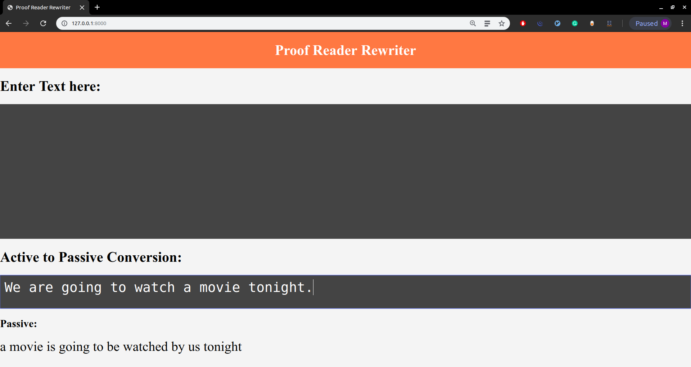
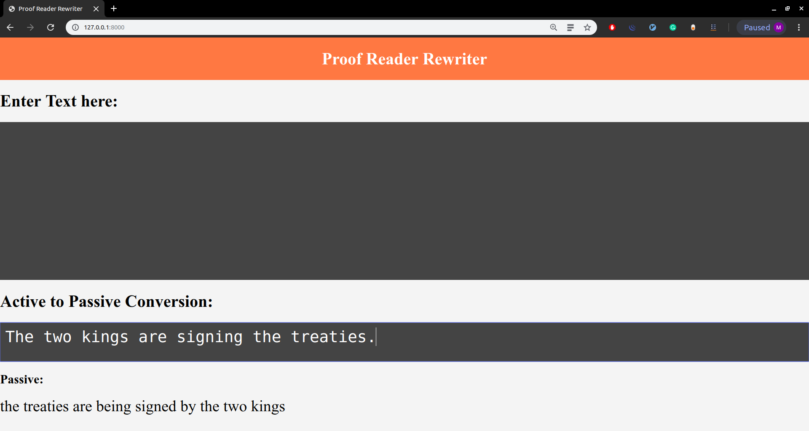

# Proof-Reader-Rewriter

---

Mohammad Taufeeque, Utkarsh Agarwal, Arjun Kashettiwar

---

Proof Reader Rewiter is a web application developed in Django that takes sentences as input from the user and uses natural language processing to provide spelling errors, grammar corrections and synonnyms to the user. It also provides the functionality to convert active voice sentences to passive voice.

## Installation
Make sure you have the following libraries installed on your system to run the webapp:
- django
- nltk
- pattern

## Interface Functionality
The user can enter sentences in the text box. As soon as a full stop, question mark or an exclamation mark is detected, the tool runs and first provides all the spelling errors by highlighting them in orange. The user can click on them to see the suggested corrected words. After all the spelling errors are corrected, the tool provides grammatical errors in green and the user once again can click on them to see the suggested corrections. After all grammatical errors are corrected, the tool provides synonyms for certain words in yellow if it finds any.  
For the conversion of active voice to passive, the user can enter a sentence in the corresponding box and the converted sentence is shown below the box. Currently, capatilizations and puncuations are not dealt with.

## Implementation
### Spell Check
Spellings in the input sentences are first checked with a dictionary of 50,000 words and if a spelling is not found in the dictionary, top 3-5 suggestions are provided for the spelling errors based on the levenshtein distance and probability of occurence the surrounding bigrams and trigrams.

### Grammar Check
For checking for grammartical errors, the tool only checks for errors with articles, tenses, auxiliary verbs and demonstrative and interrogative pronouns. For checking these errors, libraries like nltk and pattern have been used to provide appropriate POS tags and relevant contextual information that have been used in N-gram analysis.

## Examples
### Spell Check

---

### Grammar Check

---

### Active-Passive Conversion

---
